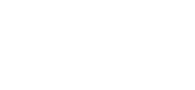
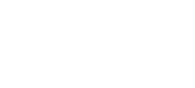
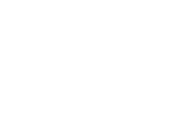

# Week 1: Union-Find

1. Which of the following is different from the set $\{2,3\}$?

* $`\{2\}\cap\{3\}`$ ✔️

* $`\{2\}\cup\{3\}`$

* $`\{2,2,3\}`$

* $`\{3,2\}`$


#### Review

* $`\{2\}\cap\{3\} = \varnothing`$ ✔️

* $`\{2\} \cup \{3\} = \{2,3\}`$

* $`\{2,2,3\} = \{2,3\}`$

* $`\{3,2\} = \{2,3\}`$

<br/>

The correct anwer is option 1. $`\varnothing \not = \{2,3\}`$. In mathematical sets duplicate elements are not allowed, hence $`\{2,2,3\}`$ is considered being equal to $`\{2,3\}`$, also the order of elements does not matter, as a set is defined by the distinct elements in the set, and not by the order of which the elements are written.

#

2. Which of the following is an element of ($\in$) $`\{9, 2, 7\}`$ ?

* $9$ ✔️

* $1$

* $`\{9,2\}`$

* $`\{9,2,7\}`$

#### Review

* $`9\in \{9,2,7\}`$ ✔️

* $`1\notin \{9,2,7\}`$

* $`\{9,2\}\notin \{9,2,7\}`$

* $`\{9,2,7\}\notin \{9,2,7\}`$

<br/>

The correct answer is option 1, $`9\in \{9,2,7\}`$. $1$ does simply not appear in the set. For option 2 and 3, even though the elements of both sets appear in $`\{9,2,7\}`$, the sets themselves are not part of the set. The correct way to describe sets of 2 and 3 would be

$`\{9,2\} \subset \{9,2,7\}`$, or $`\{9,2\} \subseteq \{9,2,7\}`$

$`\{9,2,7\} \subseteq \{9,2,7\}`$

#

3. Which of the following is a proper subset ($`\subset`$) of $`\{9, 2, 7\}`$ ?

* $9$ 

* $1$

* $`\{9,2\}`$ ✔️

* $`\{9,2,7\}`$

#### Review

* $`9 \not \subset \{9,2,7\}`$

* $`1 \not \subset \{9,2,7\}`$

* $`\{9,2\} \subset \{9,2,7\}`$ ✔️

* $`\{9,2,7\} \not \subset \{9,2,7\}`$

<br/>

The correct answer is option 3, $`\{9,2\} \subset \{9,2,7\}`$, as every element of $`\{9,2\} `$ appear in $`\{9,2,7\}`$ and $`\{9,2\} \not = \{9,2,7\}`$, making it a proper subset. For option 4, as every element is in both sets violating the criteria for being a proper subset

#

4. Which of the following is a subset ( $`\subseteq`$ ) of of $`\{9,2,7\}`$, but not a proper subset ( $`\subset`$ ) ?

* $9$

* $1$

* $`\{9,2\}`$

* $`\{9,2,7\}`$ ✔️

#### Review

* $`9 \not \subseteq \{9,2,7\}`$

* $`1 \not \subseteq \{9,2,7\}`$

* $`\{9,2\} \subseteq \{9,2,7\}`$, however $`\{9,2\} \subset \{9,2,7\}`$

* $`\{9,2,7\} \subseteq \{9,2,7\}`$, and $`\{9,2,7\} \not \subset \{9,2,7\}`$ ✔️

<br/>

The correct answer is option 4, as $`\{9,2,7\} = \{9,2,7\}`$ it can't be a proper subset, but is indeed a subset.

#

5. Which set is described by the rule $`\{x: x < 6`$, $x$ is a positive integer $`\}`$?

* $`\{\dots, –3, –2, –1, 0, 1, 2, 3, 4, 5\}`$

* $`\{0, 1, 2, 3, 4, 5\}`$

* $`\{1, 2, 3, 4, 5\}`$ ✔️

<br/>

$0$ is not considered a positive integer, hence option 4 is the correct answer. Option 1 is obviously incorrect as it has infinite negative integers.

#

6. Which of the following statements is true?

* $`\{2,4\}\in\{2,4,6\}`$

* $`\varnothing \subseteq\{2,4,6\}`$ ✔️

* $`2 \subseteq\{2,4,6\}`$

* $`\{2,4,6\} \subset\{2,4,6\}`$

* $`\{2\} \in\{2,4,6\}`$

<br/>

The correct answer is option 2, as $\varnothing$ is a subset of all sets. For 1 and 5, the sets themselves are not in the other set and are therefore false. Option 3 states that $`2 \subseteq\{2,4,6\}`$, however as $2$ is not a set, it cannot be a subset of another set. Option 4, $`\{2,4,6\} \not\subset\{2,4,6\}`$ as $`\{2,4,6\} =\{2,4,6\}`$.

#

7. Which of the following sentences are true for any instance of Union-Find?

* $\forall$ components, $\exists$ exactly one element which refers to itself
* $\forall$ elements, $\exists$ exactly one element which refers to itself
* $\forall$ components, $\exists$ at least one element which refers to itself
* $\forall$ elements, $\exists$ at least one element which refers to itself
* $\forall$ elements, $\exists$ no elements which refers to itself
* $\forall$ components, $\exists$ no elements which refers to itself
* $\forall$ elements, $\exists$ another element which refers to it
* $\forall$ elements, $\exists$ a component it belongs to

#

8. Give the value printed by the following code fragment:

```java
int sum = 0;
for (int i = 1; i < 1000; i++)
   for (int j = 0; j < i; j++)
      sum++;
StdOut.println(sum);
```

```python
sum = 0
i = 1
while i < 1000:
    j = 0
    while j < i:
        sum += 1
        j += 1
    i +=1
print(sum)
```

* a. $499500$ ✔️
* b. $500500$
* c. $1000000$
* d. $1000$
* e. $10000$

This can be calculated using the formula $sum=\frac{n(n+1)}{2}$, with $n=999$.

$$
\begin{aligned}
\frac{999\cdot(999+1)}{2} &= \frac{999\cdot(1000)}{2}\\
&= 499500 
\end{aligned}
$$

#

9. Give the value printed by the following code fragment:

```java
int sum = 0;
for (int i = 1; i < 1000; i *= 2)
    for (int j = 0; j < 1000; j++)
        sum++;
StdOut.println(sum);
```

```python
sum = 0
i = 1
while i < 1000:
    j = 0
    while j < 1000:
        sum += 1
        j += 1
    i *=2
print(sum)
```

* a. $10000$ ✔️
* b. $1000$
* c. $1000000$
* d. $100000$

<br/>

Outer loop iterates 10 times, as the value of $i=512$ after the 10th iteration it terminates. The inner loop iterates 1000 times regardless of the value of $i$, resulting in $sum=10000$.

#

10. What does the following code fragment print?

```java
String string1 = "hello";
String string2 = string1;
string1 = "world";
StdOut.println(string1 + " " + string2);
```

```python
string1 = "hello"
string2 = string1
string1 = "world"
print(string1 + " " + string2)
```

* world hello ✔️
* hello world
* hello hello
* world world

#

11. Below is a drawing of three union-find instances, and 12 descriptions of a union-find instance represented in either set notation, or as `id[]`arrays as a result of either the quick find or quick union implementations of union-find. Drag these 12 descriptions to the drawing of a union-find instance, which they fit. The categories are colour-coded as follows: White: Quick-find Blue: Quick-union Grey: "Ordered" Set Purple: "Disordered" Set.

<br/>

<div>
  
</div>

<br/>
<br/>

$
\begin{array}{c c c c c c c c c}
  \text{Quick-find} & 1 & 2 & 3 & 4 & 5 & 6 & 7 & 8 \\
                    & 7 & 2 & 3 & 3 & 3 & 3 & 7 & 8 \\
\end{array}
$

$
\begin{array}{c c c c c c c c c}
  \text{Quick-union} & 1 & 2 & 3 & 4 & 5 & 6 & 7 & 8 \\
                     & 7 & 2 & 3 & 3 & 3 & 5 & 7 & 8 \\
\end{array}
$

$`\text{Ordered Set \,\,\,} \{8\},\{7,1\},\{2\},\{6,3,5,4\}`$

$`\text{Disordered Set \,\,\,} \{1,7\},\{2\},\{3,4,5,6\},\{8\}`$

<br/>

<div>
  
</div>

<br/>
<br/>

$
\begin{array}{c c c c c c c c c}
  \text{Quick-find} & 1 & 2 & 3 & 4 & 5 & 6 & 7 & 8 \\
                    & 1 & 1 & 3 & 1 & 1 & 1 & 7 & 7 \\ 
\end{array}
$

$
\begin{array}{c c c c c c c c c}
  \text{Quick-union} & 1 & 2 & 3 & 4 & 5 & 6 & 7 & 8 \\
                     & 1 & 1 & 3 & 1 & 4 & 4 & 7 & 7 \\
\end{array}
$

$`\text{Ordered Set \,\,\,} \{3\},\{8,7\},\{1,5,2,4,6\}`$

$`\text{Disordered Set \,\,\,} \{1,2,4,5,6\},\{3\},\{7,8\}`$

<br/>

<div>
  
</div>

<br/>
<br/>

$
\begin{array}{c c c c c c c c c}
  \text{Quick-find} & 1 & 2 & 3 & 4 & 5 & 6 & 7 & 8 \\
                    & 1 & 7 & 1 & 1 & 1 & 1 & 7 & 8 \\
\end{array}
$

$
\begin{array}{c c c c c c c c c}
  \text{Quick-union} & 1 & 2 & 3 & 4 & 5 & 6 & 7 & 8 \\
                     & 1 & 7 & 1 & 3 & 3 & 5 & 7 & 8 \\
\end{array}
$

$`\text{Ordered Set \,\,\,} \{8\},\{7,2\},\{4,5,1,3,6\}`$

$`\text{Disordered Set \,\,\,} \{1,3,4,5,6\},\{2,7\},\{8\}`$


