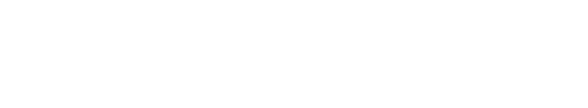
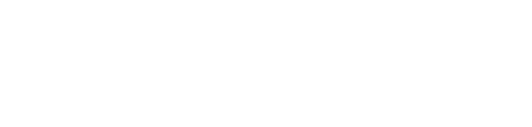
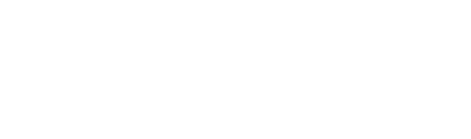

# Linked List

### Single Linked List

Forward navigation only for this variation. Each node is linked to the next, and last node link is NULL.

 

  

### Doubly Linked List

Forward and backward navigation in the list possible by linking each node to both next and previous element.

 

  

### Circular Linked List

Last element of the list is linked to the first element.

  

